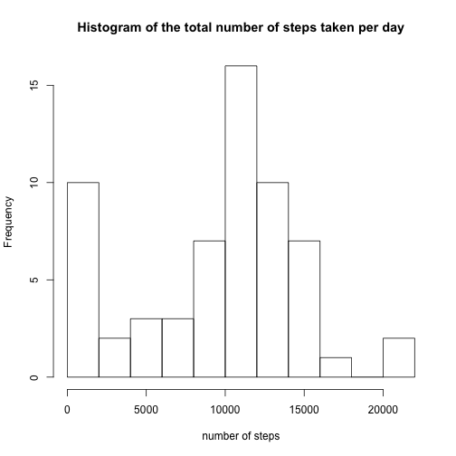
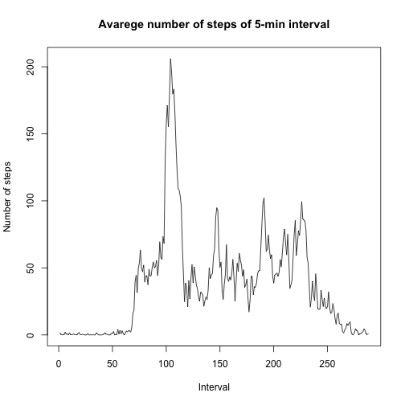
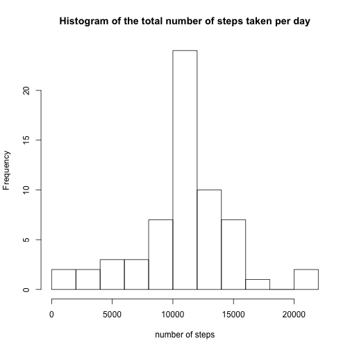
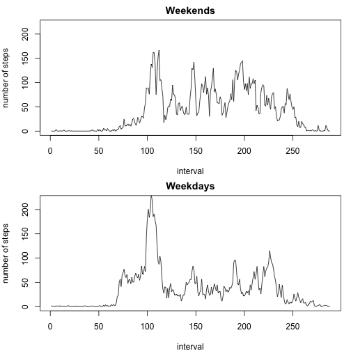

R Markdown File for Peer Assessment 1
====================================

## Loading and preprocessing the data
First load, unzip and read the dataset

```r
url<-"https://d396qusza40orc.cloudfront.net/repdata%2Fdata%2Factivity.zip"
download.file(url,destfile="repdata-data-activity.zip",method="curl")
unzip("repdata-data-activity.zip")
data<-read.csv("activity.csv")
```

## What is mean total number of steps taken per day?
Ignore the missing values for now, and calculate the total number of steps taken per day

```r
data_clean<-data[complete.cases(data),]
data_perday<-split(data_clean,data_clean$date)
total_steps<-sapply(data_perday, function (x) sum(x[,"steps"]))
```

Here is the histogram of the total number of steps taken per day

```r
hist(total_steps,breaks=12,main="Histogram of the total number of steps taken per day",xlab="number of steps")
```

 

Here is the mean and median of the toal number of steps taken per day

```r
print("the mean is: ")
```

```
## [1] "the mean is: "
```

```r
print(mean(total_steps))
```

```
## [1] 9354.23
```

```r
print("the median is: ")
```

```
## [1] "the median is: "
```

```r
print(median(total_steps))
```

```
## [1] 10395
```

## What is the average daily activity pattern?
Here is a time series plot of the 5-minute interval and the average number of steps taken, averaged across all days

```r
data_perinterval<-split(data_clean,data_clean$interval)
daily_activity<-sapply(data_perinterval, function (x) mean(x[,"steps"]))
plot(daily_activity,type="l",main="Avarege number of steps of 5-min interval",xlab="Interval",ylab="Number of steps")
```

 

Here is the 5-minute interval that contains the maximum number of steps

```r
print(which.max(daily_activity))
```

```
## 835 
## 104
```
That is, the maximum number of steps occur in the 104th 5-minute interval of the day, which corresponds to 8:35am in the morning.

## Imputing missing values
First calculate the total number of missing values in the dataset

```r
print("the total number of missing values: ")
```

```
## [1] "the total number of missing values: "
```

```r
print(sum(!complete.cases(data)))
```

```
## [1] 2304
```

Based on the mean of the 5-minute interval averaged across all days, fill in the missing values in the dataset to get a new dataset

```r
nacase<-!complete.cases(data)
imputed<-rep(daily_activity,61)
data_filled<-data
data_filled[nacase,1]<-imputed[nacase]
```

Here is the histogram of the total number of steps taken each day based on the filled dataset

```r
data_perday2<-split(data_filled,data_filled$date)
total_steps2<-sapply(data_perday2, function (x) sum(x[,"steps"]))
hist(total_steps2,breaks=12,main="Histogram of the total number of steps taken per day",xlab="number of steps")
```

 

Here is the mean and median total number of steps taken per day based on the filled dataset

```r
print("the mean is: ")
```

```
## [1] "the mean is: "
```

```r
print(mean(total_steps2))
```

```
## [1] 10766.19
```

```r
print("the median is: ")
```

```
## [1] "the median is: "
```

```r
print(median(total_steps2))
```

```
## [1] 10766.19
```
These values are different from the estimates from the first part of the assignment where missing values are ignored instead of imputed.

## Are there differences in activity patterns between weekdays and weekends?
First a new factor variable with two levels "weekday" and "weekend" was added into the dataset.

```r
day<-weekdays(as.POSIXlt(data_filled[,2]))
day<-gsub("Monday","weekday",day)
day<-gsub("Tuesday","weekday",day)
day<-gsub("Wednesday","weekday",day)
day<-gsub("Thursday","weekday",day)
day<-gsub("Friday","weekday",day)
day<-gsub("Saturday","weekend",day)
day<-gsub("Sunday","weekend",day)
day<-as.factor(day)
data_filled<-cbind(data_filled,day)
```

Here is a panel plot containing a time series plot of the 5-minute interval and the average nunber of steps taken, averaged across all weekday days or weekend days.

```r
data_weekend<-data_filled[data_filled$day=="weekend",]
data_weekday<-data_filled[data_filled$day=="weekday",]
data_perinterval2<-split(data_weekend,data_weekend$interval)
daily_activity2<-sapply(data_perinterval2, function (x) mean(x[,"steps"]))
data_perinterval3<-split(data_weekday,data_weekday$interval)
daily_activity3<-sapply(data_perinterval3, function (x) mean(x[,"steps"]))
par(mfrow=c(2,1),mar=c(4,4,2,1))
plot(daily_activity2,type="l",main="Weekends",ylim=range(0,220),xlab="interval",ylab="number of steps")
plot(daily_activity3,type="l",main="Weekdays",ylim=range(0,220),xlab="interval",ylab="number of steps")
```

 
